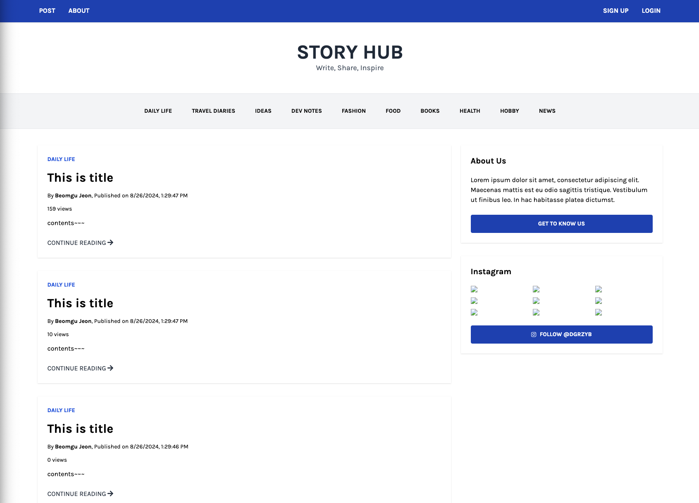

# Story Hub

[GitHub](https://github.com/JeonBeomGu-S/node-blog-project) | [Live Demo](https://node-blog-project-three.vercel.app/)

## Technologies

- **Node.js**: JavaScript runtime used for building the server-side logic.
- **Express**: Web framework for building the RESTful API and handling routing.
- **PostgreSQL**: Relational database used to store user data, posts, comments, and likes.
- **Sequelize**: ORM used to interact with PostgreSQL.
- **JWT**: JSON Web Tokens used for implementing secure user authentication.
- **MVC Architecture**: Model-View-Controller pattern used to organize the codebase.

## Overview

**Story Hub** is a blog platform built with **Node.js** and **Express**. It supports user sign-up and login, allows users to create, update, and delete posts, and supports adding, updating, and deleting comments. It uses a PostgreSQL database for data storage and Sequelize for ORM. JWT-based authentication is implemented for secure login.  


### Key Features

- **User Authentication**: Users can sign up, log in, and log out using JWT-based authentication.
- **Post CRUD Operations**: Users can create, read, update, and delete blog posts.
- **Comment System**: Users can comment on posts, and comments can be updated or deleted.
- **Like System**: Users can like posts, and view a list of posts they've liked.
- **MVC Architecture**: Code is organized into Models, Views, and Controllers for maintainability.

## API Endpoints

### User Routes

| Method | Request URL   | Description                                    |
| ------ | ------------- | ---------------------------------------------- |
| `POST` | `/api/signup` | Create a new user (with profile image upload). |
| `GET`  | `/api/signup` | Get signup page.                               |
| `POST` | `/api/login`  | Login user and get JWT token.                  |
| `GET`  | `/api/login`  | Get login page.                                |
| `POST` | `/api/logout` | Logout user.                                   |

### Post Routes

| Method   | Request URL          | Description                     |
| -------- | -------------------- | ------------------------------- |
| `POST`   | `/api/posts`         | Create a new post.              |
| `GET`    | `/api/posts`         | Get a list of posts.            |
| `GET`    | `/api/posts/:postId` | Get details of a specific post. |
| `PUT`    | `/api/posts/:postId` | Update a specific post.         |
| `DELETE` | `/api/posts/:postId` | Delete a specific post.         |

### Like Routes

| Method | Request URL  | Description                |
| ------ | ------------ | -------------------------- |
| `GET`  | `/api/likes` | Get a list of liked posts. |
| `POST` | `/api/likes` | Like a post.               |

### Comment Routes

| Method   | Request URL                | Description                                 |
| -------- | -------------------------- | ------------------------------------------- |
| `POST`   | `/api/comments/:postId`    | Add a comment to a specific post.           |
| `GET`    | `/api/comments/:postId`    | Get a list of comments for a specific post. |
| `PUT`    | `/api/comments/:commentId` | Update a specific comment.                  |
| `DELETE` | `/api/comments/:commentId` | Delete a specific comment.                  |

### About Route

| Method | Request URL | Description                         |
| ------ | ----------- | ----------------------------------- |
| `GET`  | `/about`    | Get information about the platform. |

## Installation

To clone and run this project locally, follow these steps:

1. Clone the repository:

   ```bash
   git clone https://github.com/your-username/your-repository.git
   ```

2. Navigate to the project directory:

   ```bash
   cd node-blog-project
   ```

3. Install dependencies:
   ```bash
   npm install
   ```
4. Set up your .env file: Create a .env file in the root of your project and add the required environment variables:

   ```env
   DB_DATABASE="your-db-name"
   DB_USER="your-db-user"
   DB_PASSWORD="your-db-password"
   DB_HOST="your-db-host"
   JWT_SECRET_KEY="your-jwt-secret-key"
   SERVER_LANG="your-server-lang"
   TIMEZONE="your-time-zone"
   USER_PROFILE_IMAGE_PATH="your-profile-image-path"
   POST_FILE_PATH="your-post-file-path"
   DEV_MODE=true
   ```

5. Run the development server:
   ```bash
   npm run dev
   ```
6. Visit http://localhost:3000 in your browser.
